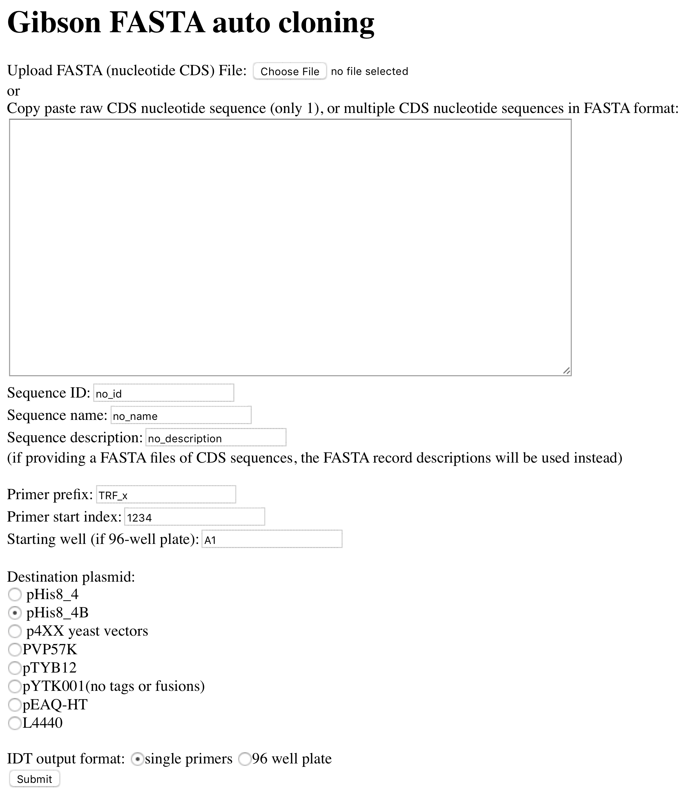

# auto_clone

This is a standalone python based server that intends to make the production of [Gibson assembly](https://en.wikipedia.org/wiki/Gibson_assembly) primers & in-silico plasmids from that cloning more straightforward. In-silico plasmids are produced in GenBank (.gb) format with an eye toward proper integration with [SnapGene](http://www.snapgene.com/).  Appropriate insert annotations (assuming the sequences you input are [CDSs](https://en.wikipedia.org/wiki/Coding_region)) are produced in the resulting .gb file(s). Primers are output either in CSV format suitable for copy pasting, or 96-well plate tables in a Excel .xlsx, both formats suitable for direct oligonucleotide synthesis orders from [IDT](https://www.idtdna.com/pages).

### Dependencies:
 * Python3.6+
 * BioPython
 * Pandas
 * SciPy (for the Tornado stand alone webserver)
 * xlwt (for export of Excel file)

### Installation (using [MacPorts](https://www.macports.org)):
```
git clone https://github.com/photocyte/auto_clone.git
sudo port install py36
sudo port install py36-scipy
sudo port install py36-pandas
sudo port install py36-biopython
sudo port install py36-xlwt
```

### Usage:
```
sudo port select --set python3 python36
cd auto_clone
python3 ./auto_clone_server.py
```
Default webaddress is http://127.0.0.1:5686

See [how_to_add_plasmids.txt](./how_to_add_plasmids.txt) to add plasmids.

###Interface example:



